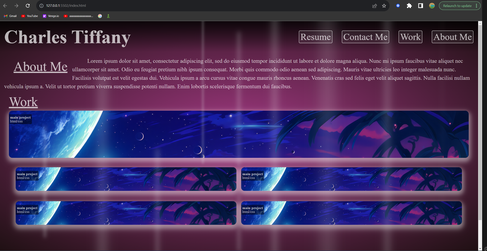

# Challenge-2

This is a portfolia that I will be adding onto in the future, I feel that I did okay on but I can always improve. I'm also not an artist, so cut me some slack.

## Table of Contents

- [About](#about)
- [Getting Started](#getting-started)
- [Usage](#usage)
- [Contributing](#contributing)
- [License](#license)

## About

The purpose of this project was to enhance my front-end development skills and understanding. During this process, I developed my own portfolio website. The website now features proper and concise code with many functions, and styling.

## Getting Started

This section is not applicable as it's a description of the project's purpose and improvements.

## Usage

This is a customer landing page, and it doesn't require specific usage instructions.

## Contributing

This project was developed by [Charles Tiffany](https://github.com/charleswt/).

## Screenshot

## License

Please refer to the LICENSE file in the repository for details.   
  (./https://github.com/charleswt/challenge-2/blob/main/LICENSE)